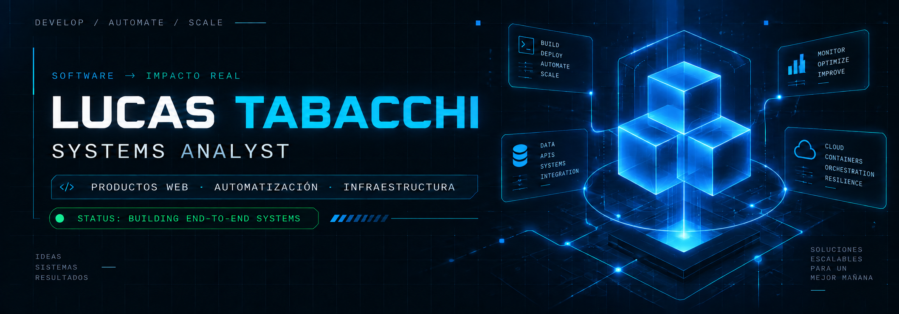

<h1 align="center">Hola, soy Lucas Tabacchi</h1>
<h3 align="center">Systems Analyst</h3>

  

  Me gusta transformar ideas en productos funcionales: desde la interfaz y la experiencia de usuario, hasta el backend, las integraciones y el despliegue.

  
  

## Sobre mí

Soy **Systems Analyst** y me enfoco en transformar ideas en productos digitales funcionales, cuidando todo el recorrido: experiencia de usuario, backend, integraciones y despliegue.

Me interesa construir soluciones end-to-end con especial atención a la **arquitectura**, la **automatización** y una base técnica mantenible.

- ⚙️ **Backend e infraestructura:** APIs, bases de datos, Docker, integraciones y automatizaciones.
- 📱 **Web & Mobile:** Desarrollo aplicaciones web end-to-end con **Next.js, React y TypeScript**, integrando interfaces, backend, autenticación, pagos, CMS, emails y bases de datos. En mobile, construyo aplicaciones multiplataforma con **React Native (Expo)**, navegación tipada, autenticación, mapas, telemetría en tiempo real y soporte offline, integradas con **Supabase, Node.js y arquitecturas orientadas a eventos**.
- 🧩 **En exploración constante:** arquitectura de software, sistemas distribuidos, developer experience y prácticas que mejoran la mantenibilidad y escalabilidad de los productos.

---

## Proyectos que muestran mi perfil

### 🤖 [AutoDocker](https://github.com/LucasTabacchi/autodocker)
**Dockerización asistida para convertir repositorios en entornos ejecutables y editables.**

- Analiza proyectos ZIP o Git y detecta stacks Node, Python, PHP, Java, Go y Ruby, incluso monorepos.
- Genera `Dockerfile`, `.dockerignore`, `docker-compose`, documentación y bootstrap de CI que se pueden editar.
- Valida builds, permite previsualizar resultados y abrir pull requests desde el flujo de trabajo.

`Python` · `Django` · `DRF` · `Celery` · `Redis` · `PostgreSQL` · `Docker` · `GitHub Actions`

---

### 📋 [ProjectFlow](https://github.com/LucasTabacchi/project-flow)
**Gestión colaborativa de proyectos con visibilidad sobre el trabajo, sus dependencias y resultados.**

- Organiza equipos con tableros, listas y tarjetas drag-and-drop, fechas límite, bloqueos y actividad.
- Incluye automatizaciones, dependencias, campos personalizados, recurrencias y reportes de tiempo.
- Centraliza invitaciones y notificaciones por email, además de exportaciones CSV y PDF.

`Next.js` · `React` · `TypeScript` · `Prisma` · `PostgreSQL` · `Tailwind CSS` · `Zustand` · `Redis`

---

### 🍫 [Amargo y Dulce](https://github.com/LucasTabacchi/frontend-ecommerce-amargo-y-dulce)
**E-commerce de chocolates diseñado para cubrir el recorrido completo de compra.**

- Ofrece catálogo, carrito, checkout, perfil, direcciones, pedidos, promociones, cupones y facturas.
- Integra Mercado Pago y procesa actualizaciones de estado de pedidos mediante webhooks.
- Consume Strapi mediante REST y GraphQL, y utiliza Brevo para emails transaccionales.

`Next.js` · `React` · `TypeScript` · `Strapi` · `GraphQL` · `Mercado Pago` · `Tailwind CSS` · `Zustand`

---

### 📨 [banking-events-kafka-nextjs](https://github.com/LucasTabacchi/banking-events-kafka-nextjs)
**Exploración de flujos basados en eventos con servicios Node, Kafka y una interfaz web.**

- Levanta Kafka y Kafka UI mediante Docker Compose para trabajar con brokers y topics configurables por entorno.
- Separa las responsabilidades en servicios `api`, `orchestrator` y `gateway` construidos con Node.js.
- Conecta una aplicación Next.js mediante URLs públicas de API y WebSockets.

`Apache Kafka` · `Docker Compose` · `Node.js` · `Next.js` · `WebSockets`

---

### 🧩 [IS2_TPFI](https://github.com/LucasTabacchi/IS2_TPFI)
**Servidor TCP en Python para aplicar patrones de diseño sobre un caso funcional y testeable.**

- Implementa un servidor con los patrones Proxy, Singleton y Observer, junto con clientes de suscripción.
- Expone operaciones `get`, `set` y `list` con persistencia intercambiable entre mock JSON y AWS DynamoDB.
- Define framing JSON de 4 bytes y cobertura automatizada con pytest.

`Python` · `TCP Sockets` · `Design Patterns` · `AWS DynamoDB` · `pytest` · `JSON`

---

## Tecnologías con las que más trabajo
### ✈️ [Airports API](https://github.com/LucasTabacchi/BDD_NSQL_2026/tree/main/airports-api)
**API y visor web para explorar 8.108 aeropuertos mediante búsquedas por cercanía y popularidad.**

- Consulta datos de aeropuertos en MongoDB y realiza búsquedas de proximidad con Redis GEO y `GEOSEARCH`.
- Ordena resultados por popularidad con Redis ZSET y una caché con TTL de un día.
- Combina un backend Node/Express con un visor HTML basado en Leaflet y MarkerCluster, orquestado con Docker Compose.

`Node.js` · `Express` · `MongoDB` · `Redis GEO` · `Leaflet` · `Docker`

---

### 🏦 [iBank](https://github.com/LucasTabacchi/Desarrollo-y-Arquitectura-en-aplicaciones-m-viles---2026/tree/main/tp_3/ibank)
**Flujo de autenticación móvil bancario con validaciones y recuperación de acceso segura.**

- Implementa login con protección contra enumeración de cuentas y registro con reglas de contraseña en tiempo real y confirmación por email.
- Gestiona restablecimiento de contraseña mediante enlaces profundos y sesiones persistentes con AsyncStorage.
- Usa formularios tipados con React Hook Form y Zod, y navegación tipada con Expo Router.

`React Native` · `Expo` · `TypeScript` · `Supabase Auth` · `Zod` · `Expo Router`

---

### 📶 [Network QoS Monitor](https://github.com/LucasTabacchi/Desarrollo-y-Arquitectura-en-aplicaciones-m-viles---2026/tree/main/tp_5)
**Monitor móvil de calidad de red en tiempo real y mapa personal de cobertura.**

- Mide RTT y jitter mediante sondas TCP, junto con throughput de subida y bajada.
- Guarda sesiones y muestras con GPS en SQLite, con exportación de datos en CSV y JSON.
- Integra métricas de señal, RAT y operador con Kotlin TelephonyManager, un backend de benchmark Fastify y pruebas móviles y de integración.

`React Native` · `TypeScript` · `Kotlin` · `SQLite` · `Fastify` · `Docker`

---

  

---

## En lo que estoy enfocado ahora

- construir productos más sólidos end-to-end
- mejorar arquitectura y mantenibilidad
- seguir creciendo entre producto, backend e infraestructura

---

## Métricas de GitHub & Actividad

  

  

