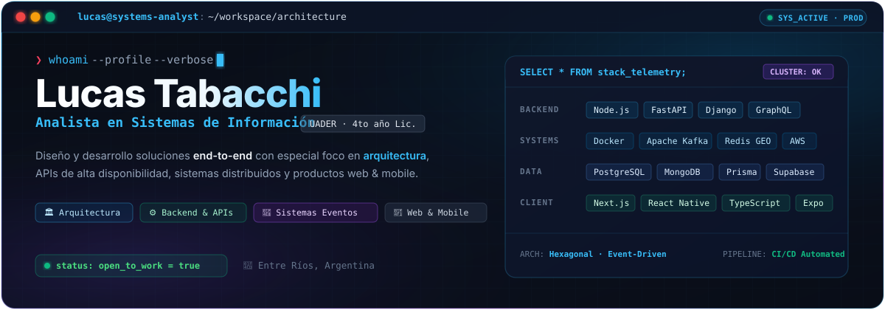

  

  Me gusta transformar ideas en productos funcionales: desde la interfaz y la experiencia de usuario, hasta el backend, las integraciones y el despliegue.

  
  
  
  

## 👨‍💻 Sobre mí

Soy **Analista en Sistemas de Información** (UADER) y actualmente cursando el 4to año de la Licenciatura en Sistemas de Información.

Me interesa construir soluciones end-to-end con especial atención a la **arquitectura** y una base técnica mantenible.

- ⚙️ **Backend e infraestructura:** APIs, bases de datos, Docker, integraciones y automatizaciones.
- 📱 **Web & Mobile:** Desarrollo aplicaciones web end-to-end con **Next.js, React y TypeScript**, integrando interfaces, backend, autenticación, pagos, CMS, emails y bases de datos. En mobile, construyo aplicaciones multiplataforma con **React Native (Expo)**, navegación tipada, autenticación, mapas, telemetría en tiempo real y soporte offline, integradas con **Supabase, Node.js y arquitecturas orientadas a eventos**.
- 🧩 **En exploración constante:** arquitectura de software, sistemas distribuidos y prácticas que mejoran la mantenibilidad y escalabilidad de los productos.

---

## 🚀 Proyectos que muestran mi perfil

<table>
  <tbody>
    <tr>
      <td width="50%" valign="top">
        <h3><a href="https://github.com/LucasTabacchi/autodocker">🤖 AutoDocker — Dockerización Asistida</a></h3>
        
<strong>Dockerización asistida para convertir repositorios en entornos ejecutables y editables.</strong>

        <ul>
          <li>Analiza repositorios y detecta stacks <strong>Node</strong>, <strong>Python</strong>, <strong>PHP</strong>, <strong>Java</strong>, <strong>Go</strong> y <strong>Ruby</strong>, incluso monorepos.</li>
          <li>Genera <strong>Dockerfile</strong>, <strong>.dockerignore</strong>, <strong>docker-compose</strong>, documentación y bootstrap de CI editables.</li>
          <li>Valida builds, permite previsualizar resultados y abrir pull requests desde el flujo de trabajo.</li>
        </ul>
        

          
          
          
          
        

      </td>
      <td width="50%" valign="top">
        <h3><a href="https://github.com/LucasTabacchi/project-flow">📋 ProjectFlow — Gestión Colaborativa</a></h3>
        
<strong>Gestión colaborativa de proyectos con visibilidad sobre el trabajo, dependencias y resultados.</strong>

        <ul>
          <li>Organiza equipos con tableros Kanban drag-and-drop, listas de tareas, fechas límite, bloqueos y actividad.</li>
          <li>Incluye automatizaciones, dependencias entre tareas, campos personalizados, recurrencias y reportes de tiempo.</li>
          <li>Centraliza invitaciones y notificaciones por email, además de exportaciones en <strong>CSV</strong> y <strong>PDF</strong>.</li>
        </ul>
        

          
          
          
          
        

      </td>
    </tr>
    <tr>
      <td width="50%" valign="top">
        <h3><a href="https://github.com/LucasTabacchi/frontend-ecommerce-amargo-y-dulce">🍫 Amargo y Dulce — E-Commerce & Gestión</a></h3>
        
<strong>Plataforma e-commerce integral diseñada para cubrir el recorrido completo de compra y gestión.</strong>

        <ul>
          <li>Control de inventario, catálogo interactivo, carrito de compras, perfil de usuario, direcciones, pedidos y promociones.</li>
          <li>Integra <strong>Mercado Pago</strong> y procesa actualizaciones de estado de pedidos mediante <strong>webhooks</strong>.</li>
          <li>Consume <strong>Strapi</strong> mediante REST y <strong>GraphQL</strong>, y utiliza <strong>Brevo</strong> para emails transaccionales.</li>
        </ul>
        

          
          
          
          
        

      </td>
      <td width="50%" valign="top">
        <h3><a href="https://github.com/LucasTabacchi/banking-events-kafka-nextjs">💳 Docker Banking Microservices</a></h3>
        
<strong>Arquitectura orientada a eventos con procesamiento asíncrono de transacciones bancarias.</strong>

        <ul>
          <li>Microservicios desacoplados y contenerizados con <strong>Docker</strong> y <strong>Docker Compose</strong>.</li>
          <li>Mensajería asíncrona y transmisión de eventos en tiempo real mediante <strong>Apache Kafka</strong>.</li>
          <li>Diseño modular con <strong>TypeScript</strong> y <strong>Node.js</strong> para alta disponibilidad y tolerancia a fallos.</li>
        </ul>
        

          
          
          
          
        

      </td>
    </tr>
    <tr>
      <td width="50%" valign="top">
        <h3><a href="https://github.com/LucasTabacchi/BDD_NSQL_2026/tree/main/airports-api">✈️ Airports API — Geospatial & Cache</a></h3>
        
<strong>API y visor web para explorar aeropuertos mediante búsquedas por cercanía y popularidad.</strong>

        <ul>
          <li>Consulta datos de aeropuertos en <strong>MongoDB</strong> y realiza búsquedas de proximidad con <strong>Redis GEO</strong> (<code>GEOSEARCH</code>).</li>
          <li>Ordena resultados por popularidad con <strong>Redis ZSET</strong> y una estrategia de caché con TTL de un día.</li>
          <li>Combina un backend <strong>Node.js</strong> / <strong>Express</strong> con un visor HTML interactivo en <strong>Leaflet</strong>, orquestado con <strong>Docker Compose</strong>.</li>
        </ul>
        

          
          
          
          
        

      </td>
      <td width="50%" valign="top">
        <h3><a href="https://github.com/LucasTabacchi/Desarrollo-y-Arquitectura-en-aplicaciones-m-viles---2026/tree/main/tp_3/ibank">🏦 iBank — Mobile Banking Auth</a></h3>
        
<strong>Flujo de autenticación móvil bancario con validaciones y recuperación de acceso segura.</strong>

        <ul>
          <li>Implementa login con protección contra enumeración de cuentas y registro con reglas de validación en tiempo real y confirmación por email.</li>
          <li>Gestiona restablecimiento de contraseña mediante enlaces profundos (<strong>deep links</strong>) y sesiones persistentes con <strong>AsyncStorage</strong>.</li>
          <li>Usa formularios tipados con <strong>React Hook Form</strong> + <strong>Zod</strong>, y arquitectura de navegación tipada con <strong>Expo Router</strong>.</li>
        </ul>
        

          
          
          
          
        

      </td>
    </tr>
    <tr>
      <td colspan="2" valign="top">
        <h3><a href="https://github.com/LucasTabacchi/Desarrollo-y-Arquitectura-en-aplicaciones-m-viles---2026/tree/main/tp_5">📶 Network QoS Monitor — Mobile & Benchmark</a></h3>
        
<strong>Monitor móvil de calidad de red en tiempo real y mapa personal de cobertura.</strong>

        <ul>
          <li>Mide <strong>RTT</strong> y <strong>jitter</strong> mediante sondas TCP, junto con throughput de subida y bajada.</li>
          <li>Guarda sesiones y muestras con GPS en <strong>SQLite</strong>, con exportación de datos en <strong>CSV</strong> y <strong>JSON</strong>.</li>
          <li>Integra métricas de señal, RAT y operador con <strong>Kotlin TelephonyManager</strong>, un backend de benchmark en <strong>Fastify</strong> y pruebas móviles.</li>
        </ul>
        

          
          
          
          
          
        

      </td>
    </tr>
  </tbody>
</table>

---

## 🛠️ Tecnologías con las que más trabajo

### 🌐 Lenguajes & Web

  

### ⚙️ Backend & APIs

  

### 📱 Mobile

  

### ☁️ Datos & Cloud

  

### 📦 Infraestructura & Eventos

  

### 🧪 Calidad, UI & DX

  

### 🤖 Datos e IA

  

---

## 🎯 En lo que estoy enfocado ahora

- construir productos más sólidos end-to-end
- mejorar arquitectura y mantenibilidad
- seguir creciendo entre producto, backend e infraestructura

---

## 📊 Métricas de GitHub & Actividad

  
  

  

